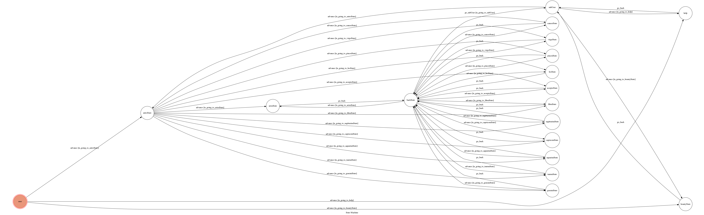

# TOC_Project_ChatBot [星座&妹子機器人]

## Introduction

#### Run `ngrok`

```sh
./ngrok http 5000
```

After that, `ngrok` would generate a https URL.

#### Run the sever

```sh
python3 webhook_handler.py
```

## Finite State Machine


## Usage
The initial state is set to `user`.


* user
	* Input: "查星座"
		* Reply: "想查什麼星座呢？"
		* Input: "巨蟹座"、"牡羊座"、...
		    * Reply: Information of the astro which is caught from internet(Crawler)
		    * Input: "查其他"
		        * go to `subUser` state which all state after `user` will be back to it
		        * You can input "查星座" or "圖呢" again.

	* Input: "圖呢"
		* Reply: Pictures of the beauties which is caught from internet(Crawler)
		* go to `subUser` state which all state after `user` will be back to it
		* You can input "查星座" or "圖呢" again.